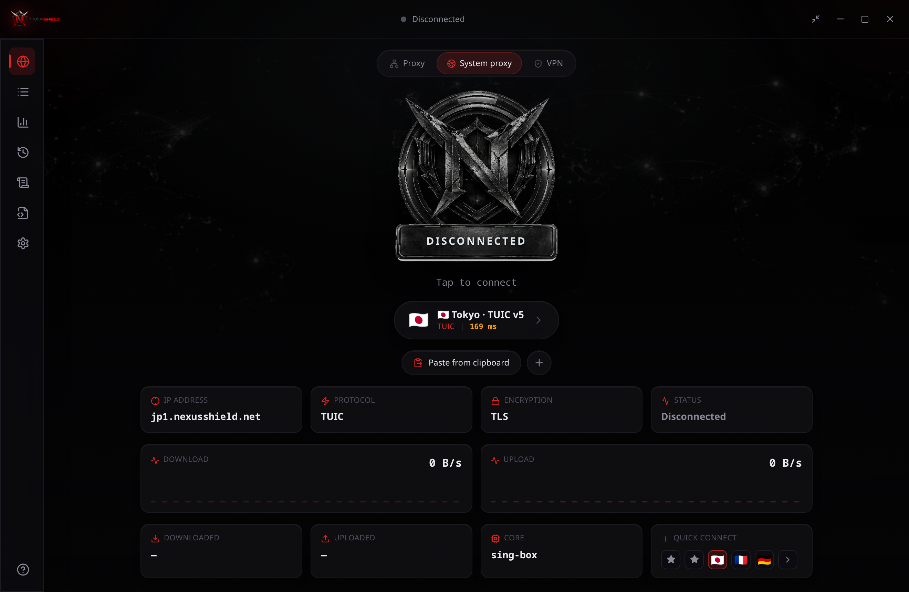
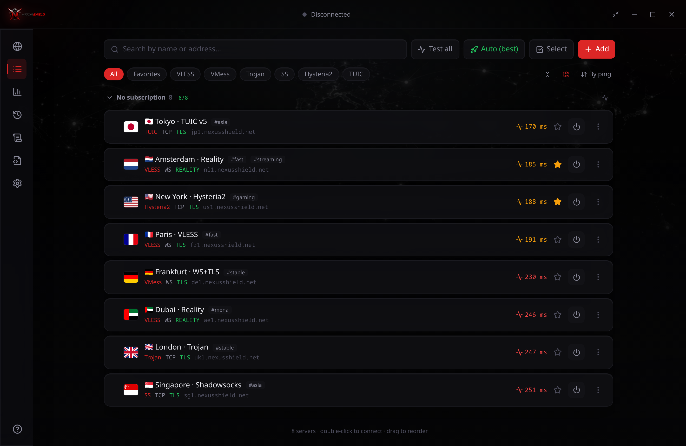
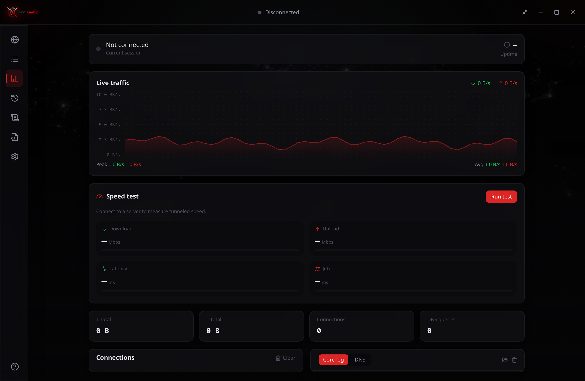
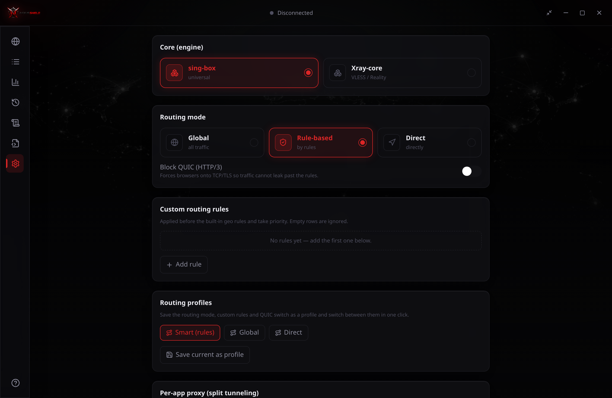
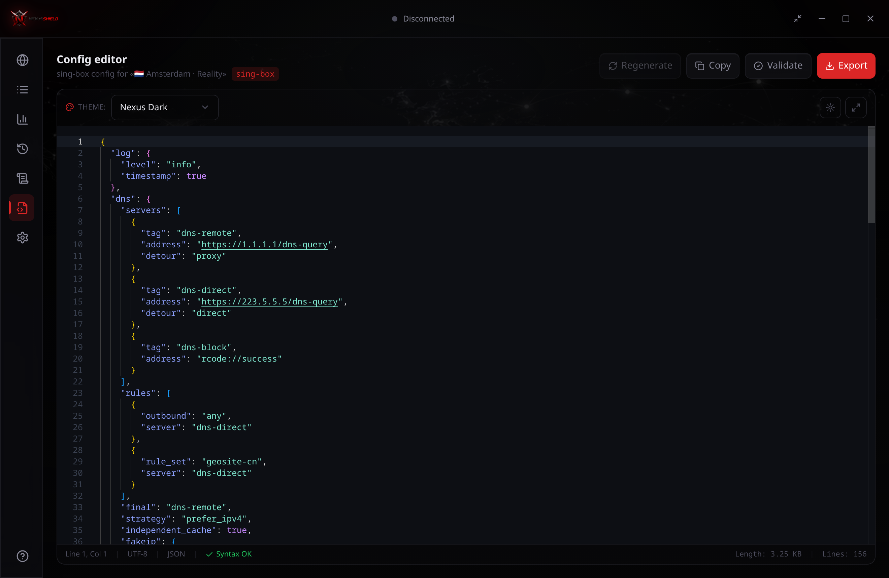
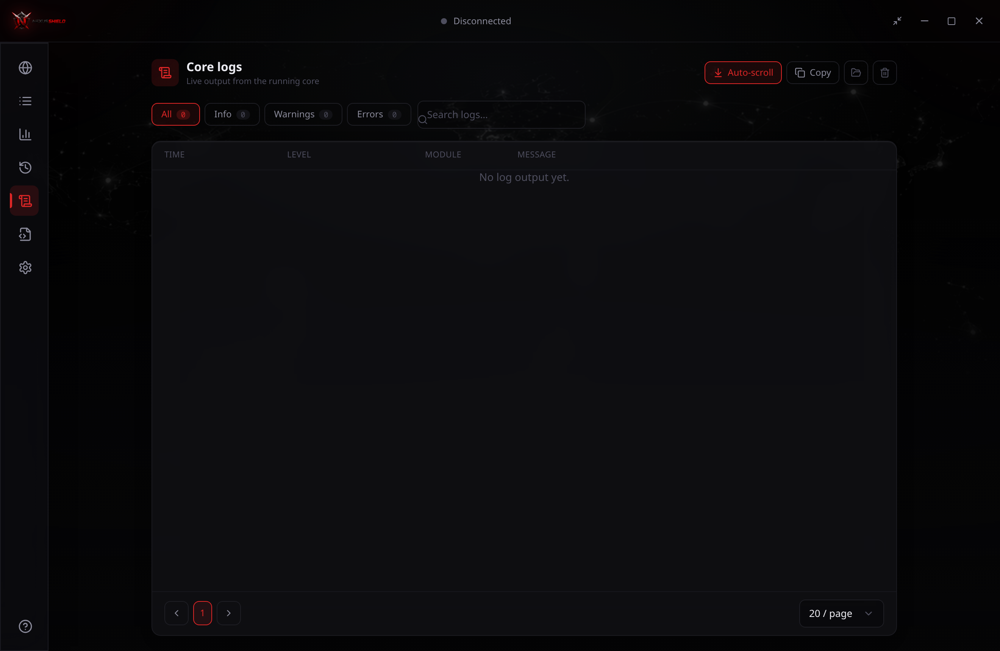
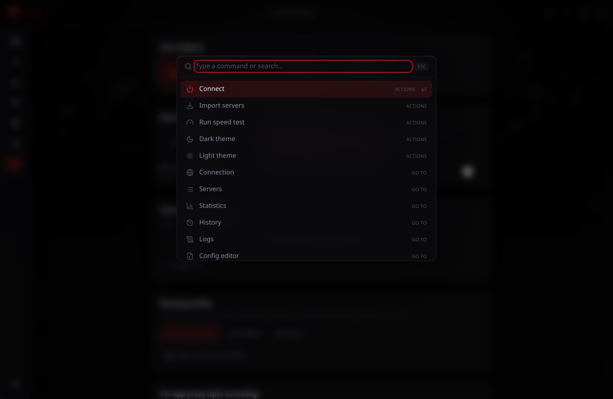

<div align="center">


# NexusShield

**A universal, cross-platform desktop VPN / proxy client for Xray-core & sing-box.**
Two engines, a full modern protocol set, a glassmorphism UI — no terminal required.

`Tauri v2` · `Rust` · `React 18` · `TypeScript` · `Tailwind v4` · `Zustand`

[](https://github.com/timur123-star/Nexus/actions/workflows/ci.yml)
[](https://tauri.app/)
[](https://www.rust-lang.org/)
[](https://react.dev/)
[](https://www.typescriptlang.org/)
[](https://tailwindcss.com/)
[](https://vitest.dev/)
[](#building-from-source)
[](./LICENSE)

[Source](https://github.com/timur123-star/Nexus) · [Author's site](https://gradumacademy.ru/) · [Features](#features) · [Screenshots](#screenshots) · [Build](#building-from-source)

</div>



---

## About this project

**NexusShield** is a portfolio project by **TIMUR VALERIEVICH** ([timur123-star](https://github.com/timur123-star) · [gradumacademy.ru](https://gradumacademy.ru/)) — a production-grade, cross-platform VPN / proxy desktop client built from scratch.

It wraps the two leading proxy engines — **Xray-core** and **sing-box** — behind a single, unified UI. Instead of editing JSON configs by hand, the user imports a server link, a subscription or a QR code, picks a node, and connects. NexusShield generates the engine config, raises a TUN tunnel or a system proxy with the right privileges per OS, and shows live traffic, connections, DNS and core logs — all in one window.

Everything here was designed and engineered manually: the dual-core abstraction, the link parsers, the config generators, the Rust system-integration layer (TUN, system proxy, privilege elevation, TCP ping), the crimson glassmorphism design system, and the test suite that guards it. No CMS, no no-code builders, no copy-pasted boilerplate.

> **Disclaimer.** The servers, locations and latency values shown in the screenshots are demo data for the portfolio. NexusShield is a client only — it ships no servers and no credentials.
>
> Designed and built by **TIMUR VALERIEVICH** · [gradumacademy.ru](https://gradumacademy.ru/)

---

## Features

**Two engines, one abstraction**
- **sing-box** and **Xray-core** behind a single `IProxyCore` interface — the app auto-selects the right engine for each node (e.g. forces Xray for XHTTP / post-quantum REALITY, sing-box for Hysteria2).

**Protocols & import**
- Full modern protocol set: **VLESS, VMess, Trojan, Shadowsocks, Hysteria2, Hysteria v1, TUIC, WireGuard (+ one-click Cloudflare WARP), AnyTLS, ShadowTLS, SOCKS5, HTTP(S) CONNECT, SSH, Tor** — including REALITY, `flow`/Vision, XHTTP and post-quantum REALITY.
- Parses `vless://`, `vmess://`, `trojan://`, `ss://`, `hy2://` / `hysteria2://`, `hysteria://`, `tuic://`, `wireguard://` / `wg://`, `anytls://`, `shadowtls://`, `socks://` / `socks5://`, `http(s)://`, `ssh://`, `tor://`.
- Import from link, list, base64 subscription, clipboard, or a **QR code from file/clipboard**, with automatic format detection.

**Servers & subscriptions**
- **Subscriptions** with scheduled auto-update, status badges and custom `User-Agent` (Hiddify/Marzban-compatible).
- Servers grouped by subscription with collapsible groups.
- **Ping all servers + Auto (best)** — picks the lowest-latency node by real TCP latency.

**Routing & tunneling**
- **Routing profiles** — save mode, custom rules and QUIC blocking as a one-click preset.
- **Per-app proxy (split tunneling)** with presets for popular apps.
- Full config generation: TLS, REALITY, ws / grpc / h2, TUN, fake-IP, DNS, custom rules.
- **TUN mode** with privilege elevation per OS (UAC / `osascript` / `pkexec`).
- **System proxy** for Windows (registry), macOS (`networksetup`), Linux (`gsettings`).

**Insight**
- **Statistics** via Clash API: live traffic graph, connections, core log and **DNS log**.
- Built-in **speed test** (download / upload / latency / jitter) through the tunnel.
- Live core log streamed straight into the UI; toast notifications for connection state.
- **Monaco config editor** with syntax highlighting, validation, offline workers and export.

**Experience**
- **Auto-update** (`tauri-plugin-updater`, signed release artifacts).
- System tray, custom titlebar, **dark / light / OLED** themes, crimson accent system.
- Localized in **English, Russian, Persian (fa) and Chinese (zh)** with strict key-parity.
- **⌘K / Ctrl+K command palette** and global hotkeys (`Ctrl+,`, `Ctrl+I`).
- framer-motion animations honouring `prefers-reduced-motion`.
- Persistence via SQLite (`tauri-plugin-sql`) with a localStorage fallback.

---

## Screenshots

| Servers — ping & Auto (best) | Statistics & speed test |
| :--: | :--: |
|  |  |

| Settings — cores & routing | Config editor (Monaco) |
| :--: | :--: |
|  |  |

| Live logs & DNS | Command palette (⌘K) |
| :--: | :--: |
|  |  |

---

## Tech stack

| Layer | Technology | Why |
| --- | --- | --- |
| Shell / runtime | [Tauri v2](https://tauri.app/) + Rust | tiny native binary, OS-level access, WebView UI |
| Proxy engines | [Xray-core](https://github.com/XTLS/Xray-core) · [sing-box](https://github.com/SagerNet/sing-box) | best-in-class protocol coverage, bundled as resources |
| UI | [React 18](https://react.dev/) + [TypeScript 5](https://www.typescriptlang.org/) (strict) | typed, component-driven UI |
| Styling | [Tailwind CSS v4](https://tailwindcss.com/) + framer-motion | crimson glassmorphism design system |
| State | [Zustand](https://github.com/pmndrs/zustand) | small stores for servers, connection, settings, toasts |
| Persistence | [tauri-plugin-sql](https://github.com/tauri-apps/plugins-workspace) (SQLite) | durable state, localStorage fallback |
| Config editor | [Monaco](https://microsoft.github.io/monaco-editor/) | VS Code-grade JSON editing, offline workers |
| Updates | [tauri-plugin-updater](https://github.com/tauri-apps/plugins-workspace) | signed auto-updates from GitHub Releases |
| Tests / CI | [Vitest](https://vitest.dev/) + GitHub Actions | parsers, config gen, DNS, scheduler, i18n parity |

---

## Architecture

```
                    React + TypeScript UI  (Tauri WebView)
   ┌──────────────────────────────────────────────────────────────┐
   │  features/ (connection · servers · stats · editor · settings) │
   │  store/ (Zustand)            shared/ (components · hooks)      │
   └───────────────┬───────────────────────────┬──────────────────┘
                   │                            │
        src/core/proxy/ IProxyCore        src/core/i18n (ru/en/fa/zh)
        ┌──────────┴──────────┐           src/core/parser · dns · subscriptions
        ▼                     ▼
   core/xray/configGen   core/singbox/configGen      core/db.ts (SQLite)
        │                     │
        └──────────┬──────────┘
                   ▼  Tauri IPC (invoke)
   ┌──────────────────────────────────────────────────────────────┐
   │  src-tauri/src/  (Rust)                                       │
   │  core.rs · ping.rs · sysproxy.rs · privilege.rs · tray.rs    │
   │  spawns / supervises sing-box | xray  ·  TUN  ·  system proxy │
   └──────────────────────────────────────────────────────────────┘
```

- `src/core/proxy/` — `IProxyCore` abstraction + core registry (`getCore`, `ALL_CORES`).
- `src/core/singbox/` & `src/core/xray/` — config generators (unit-tested).
- `src/core/parser/`, `qr.ts`, `dns.ts`, `subscriptions/scheduler.ts` — parsing & scheduling (tested).
- `src/core/i18n/` — ru/en/fa/zh dictionaries with a strict key-parity test.
- `src-tauri/src/` — Rust: `core.rs`, `ping.rs`, `sysproxy.rs`, `privilege.rs`, `commands.rs`, `tray.rs`.

---

## Building from source

### Requirements
- Node.js ≥ 20, Rust ≥ 1.90 (msvc on Windows), WebView2 (Windows).
- The `sing-box` and `xray` core binaries (fetched by a script, see below).

### Steps
```bash
npm install

# fetch cores (sing-box + xray + geo assets) for the current OS
npm run fetch-cores

# generate app icons (once)
npm run tauri icon assets/icon-source.png

npm run tauri dev      # development
npm run tauri build    # build the installer
```

> Without `npm run fetch-cores` the core binaries are missing and connections will not start.
> TUN mode requires administrator privileges; the system proxy only routes proxy-aware apps.

Core binaries are placed in `src-tauri/binaries/` and bundled as resources. `xray` needs
`geosite.dat` and `geoip.dat` (the script places them too); sing-box pulls rule-sets online.

### Frontend only (no core)
```bash
npm run dev            # IPC calls return mocks — handy for UI work
```

---

## Tests & checks
```bash
npm test               # vitest — parser, DNS, subscription scheduler, config gen, i18n parity
npm run lint           # tsc --noEmit
cargo check --manifest-path src-tauri/Cargo.toml
```

CI runs the frontend typecheck + tests and `cargo check` on every push.

---

## Author

**TIMUR VALERIEVICH** — [github.com/timur123-star](https://github.com/timur123-star) · [gradumacademy.ru](https://gradumacademy.ru/)

This repository is part of my engineering portfolio.

## License

Released under the [MIT License](./LICENSE).
